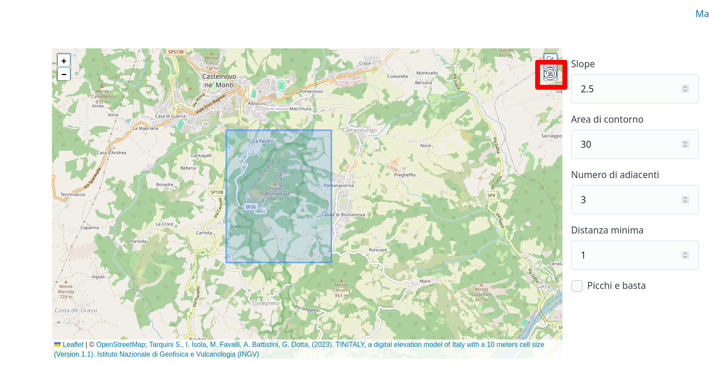

# SpitSpot
  
  
## SETUP

1) Download the zip corresponding to your area of interest from here:
https://tinitaly.pi.ingv.it/Download_Area1_1.html
2) Open the zip and place the geotiff in `python/data-sources`, naming it `source-{name-of-your-choice}.tif`
3) Run `docker-compose up` to start the project. It'll now be reachable at http://localhost:8000.
4) When the container is up and running, execute `http -v POST  localhost:8000/init filename={name-of-your-choice} lat1={x1}  lon1={y1} lat2={x2} lon2={y2}`. 
    Notice: I assume you have `httpie` installed on your system. If you don't, you can use `cURL`:
    ```
    curl -v -X POST "http://127.0.0.1:8000/init" \
    -d "filename={name-of-your-choice}" \
    -d "lat1={x1}" \
    -d "lon1={y1}" \
    -d "lat2={x2}" \
    -d "lon2={y2}"
    ```
   Supposing you downloaded w49060_s10.zip and placed the geotiff in data-sources, with the name `source-bismantova.tif`
   ```http -v POST  127.0.0.1:8000/init filename=bismantova lat1=44.428633495773006 lon1=10.404637169518928 lat2=44.41019223908658 lon2=10.425157949161745```
    This might take a long time, depending on the size of the area.
5) Register your user. You will now be redirected to /map.
6) Now you can start searching for spots in the loaded area. Well known example:
    2.5 slope will allow to find most of the iconic lines in the Bismantova area. To start the scan, click the button on the top right of the map with the radar icon:
   

## Useful documentation:

https://github.com/KipCrossing/geotiff Library used to read the geotiff data.

https://redis.io/docs/latest/develop/data-types/geospatial/ Starting point for geospatial redis queries.

[Contribution guide](CONTRIBUTING.md)
